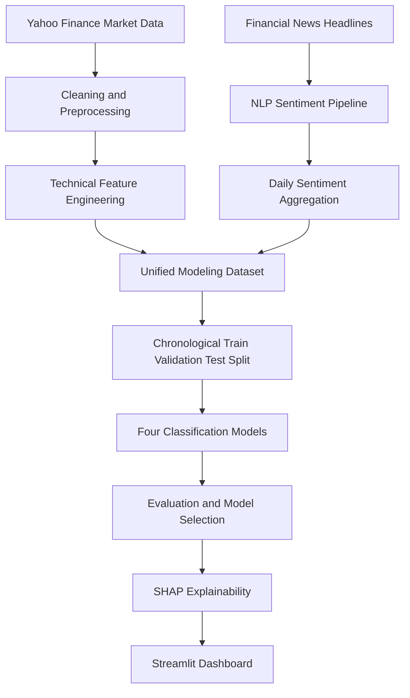
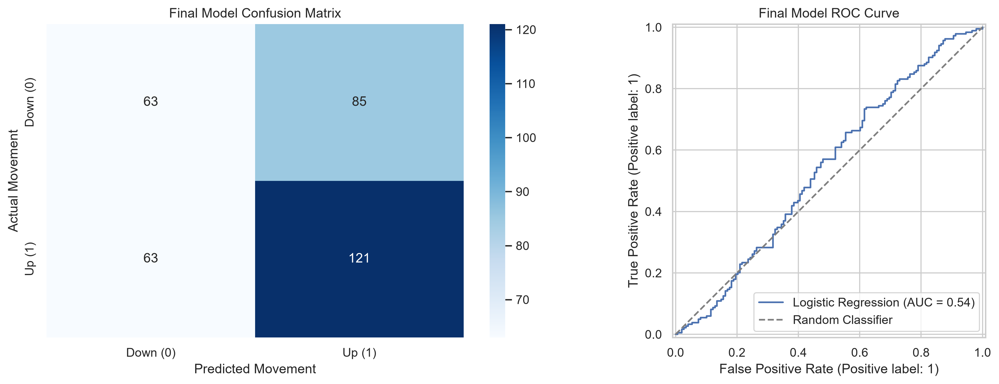
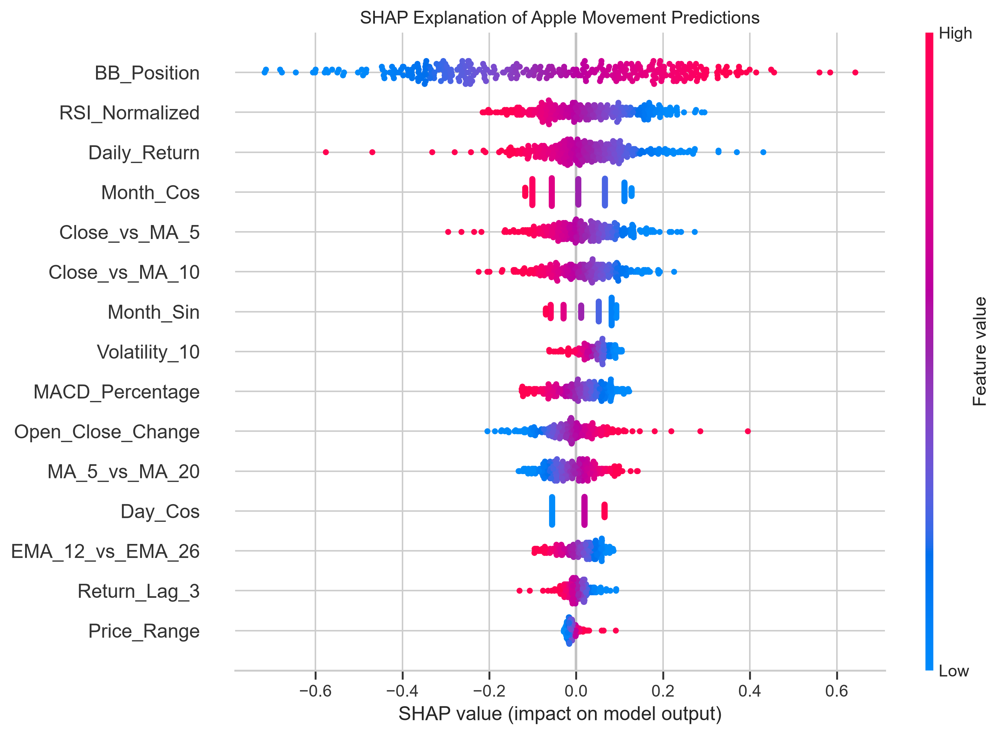
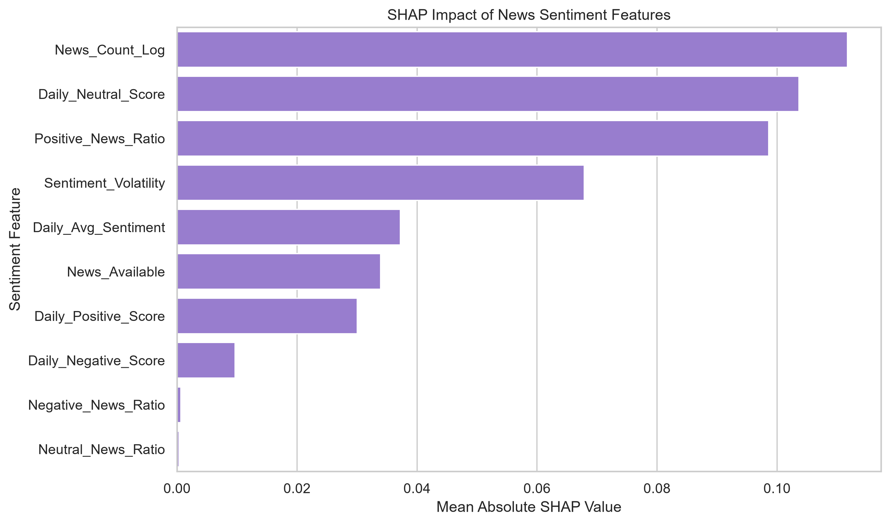

# Financial Market Movement Prediction Using News Sentiment and Market Data

An end-to-end data science and machine learning project that analyzes Apple Inc. (AAPL) market data and financial-news sentiment to predict whether Apple’s closing price will increase or decrease on the next trading day.

The project includes data collection, preprocessing, NLP sentiment analysis, time-series feature engineering, four classification models, SHAP explainability and an interactive Streamlit dashboard.

## Live Application

[Open the live Streamlit dashboard](https://raginiboya-financial-market-prediction.streamlit.app/)

## Project Objective

The objective is to predict Apple’s next-trading-day price direction:

- `1` — The next closing price is higher than the current closing price
- `0` — The next closing price is lower than or equal to the current closing price

## Business Applications

- Investment research
- Financial trend analysis
- Market-sentiment monitoring
- Trading-signal experimentation
- Explainable financial machine learning
- FinTech analytics applications

## Data Sources

### Historical Market Data

Apple historical stock data was downloaded from [Yahoo Finance](https://finance.yahoo.com/quote/AAPL/history/) using the `yfinance` Python library.

The market variables include:

- Date
- Open price
- High price
- Low price
- Close price
- Adjusted close price
- Trading volume

### Financial Sentiment Training Data

The labelled financial-news dataset was obtained from the [Financial News Sentiment Dataset on Kaggle](https://www.kaggle.com/datasets/ankurzing/sentiment-analysis-for-financial-news).

It contains financial headlines classified as:

- Positive
- Neutral
- Negative

### Historical Apple News

Dated Apple-related headlines were obtained from the [Apple Historical Financial News Dataset](https://www.kaggle.com/datasets/frankossai/apple-stock-aapl-historical-financial-news-data).

The dataset contains 29,752 historical Apple news records from 2016 to 2024.

## Project Workflow



## Data Preprocessing

The preprocessing pipeline performs the following operations:

- Converts dates into a consistent format
- Sorts records chronologically
- Removes duplicate records
- Handles missing values
- Cleans financial-news text
- Converts sentiment labels into numerical scores
- Maps weekend and holiday news to the next valid trading day
- Prevents future data from entering historical features

## Sentiment Analysis Pipeline

Financial headlines are cleaned and converted into numerical text features using TF-IDF.

A multi-class Logistic Regression classifier predicts:

- Negative sentiment
- Neutral sentiment
- Positive sentiment

### Sentiment Model Results

| Metric | Result |
|---|---:|
| Test Accuracy | 80.03% |
| Macro F1-score | 76.87% |
| Negative F1-score | 75.13% |
| Neutral F1-score | 85.75% |
| Positive F1-score | 69.72% |

The trained TF-IDF and Logistic Regression pipeline is saved as:

```text
models/financial_sentiment_pipeline.joblib
```

## Feature Engineering

### Market Features

- Daily return
- Intraday price range
- Open-to-close change
- Volume change
- Lagged returns
- Rolling volatility

### Technical Indicators

- Simple Moving Average (SMA)
- Exponential Moving Average (EMA)
- Relative Strength Index (RSI)
- Moving Average Convergence Divergence (MACD)
- Bollinger Bands

### Stationary Features

Raw price levels were converted into relative features to reduce time-series distribution shift:

- Close relative to 5-day moving average
- Close relative to 10-day moving average
- Close relative to 20-day moving average
- Short-term versus long-term moving average
- MACD as a percentage of price
- Bollinger Band position
- Normalized RSI

### Sentiment Features

- Daily average sentiment
- Positive sentiment probability
- Neutral sentiment probability
- Negative sentiment probability
- Positive news ratio
- Neutral news ratio
- Negative news ratio
- Sentiment volatility
- News volume
- News availability

### Temporal Features

- Day-of-week sine and cosine
- Month sine and cosine

## Models Compared

The following classification models were trained and compared:

1. Logistic Regression
2. Random Forest
3. XGBoost
4. LightGBM

A chronological 70%-15%-15% train-validation-test split was used instead of random shuffling to prevent time-series data leakage.

## Final Market-Movement Model

The final model is a regularized Logistic Regression classifier trained using stationary market features from 2020 onward.

### Final Test Results

| Metric | Result |
|---|---:|
| Accuracy | 55.42% |
| Precision | 58.74% |
| Recall | 65.76% |
| F1-score | 62.05% |
| ROC-AUC | 53.82% |
| Majority Baseline | 55.42% |

The model’s accuracy equals the majority baseline, while its ROC-AUC indicates a small ranking signal above random classification.

This modest result is realistic because short-term financial-market movement contains substantial noise and changing relationships.

## Sentiment Ablation Study

The market-only model was compared with the same model using market and sentiment features.

| Feature Set | Accuracy | F1-score | ROC-AUC |
|---|---:|---:|---:|
| Market Only | 55.42% | 62.05% | 53.82% |
| Market + Sentiment | 51.20% | 58.46% | 49.20% |

In this dataset, adding sentiment reduced out-of-sample performance.

Possible reasons include:

- Inconsistent news coverage across years
- A large increase in news volume after 2020
- General market headlines mixed with Apple-specific information
- Sentiment reacting to price movement instead of predicting it
- Changing market regimes

## Explainable AI

SHAP stands for **SHapley Additive exPlanations**.

SHAP was used to explain the contribution of each feature to the model’s predictions.

The most influential final-model features were:

1. Bollinger Band position
2. Normalized RSI
3. Daily return
4. Monthly seasonality
5. Close price relative to moving averages
6. Rolling volatility
7. MACD percentage
8. Open-to-close change

Sentiment features represented 30.31% of the combined candidate model’s SHAP importance, but their influence did not improve predictive accuracy.







## Streamlit Dashboard

The dashboard contains the following pages:

- Overview
- Market Trends
- Sentiment Analysis
- Headline Sentiment Tester
- Prediction Signal
- Model Performance
- Explainability
- Project Information

The application displays:

- Apple price and volume charts
- Candlestick visualization
- Moving averages
- Sentiment and news-volume trends
- Interactive headline classification
- Next-day movement probability
- Model evaluation metrics
- SHAP explanations

## Project Structure

```text
Financial_Market_Prediction/
│
├── dashboard/
│   └── app.py
│
├── data/
│   ├── raw/
│   └── processed/
│       ├── AAPL_market_clean.csv
│       ├── AAPL_market_features.csv
│       ├── AAPL_market_with_target.csv
│       ├── AAPL_news_scored.csv
│       ├── AAPL_daily_sentiment.csv
│       ├── AAPL_modeling_dataset.csv
│       └── financial_news_clean.csv
│
├── models/
│   ├── aapl_movement_logistic_model.joblib
│   └── financial_sentiment_pipeline.joblib
│
├── notebooks/
│   ├── 01_data_collection_preprocessing.ipynb
│   ├── 02_sentiment_analysis_feature_engineering.ipynb
│   └── 03_model_training_evaluation.ipynb
│
├── outputs/
│   └── figures/
│
├── reports/
│
├── presentation/
├── src/
├── .gitignore
├── README.md
└── requirements.txt
```

## Installation

### 1. Clone the repository

```bash
git clone https://github.com/raginiboya/financial-market-prediction.git
cd Financial_Market_Prediction
```

### 2. Create a virtual environment

```bash
python -m venv venv
```

### 3. Activate the environment on Windows

```powershell
.\venv\Scripts\Activate.ps1
```

### 4. Install the required libraries

```bash
python -m pip install -r requirements.txt
```

## Run the Dashboard

```bash
streamlit run dashboard/app.py
```

The application will open at:

```text
http://localhost:8501
```

## Key Findings

- Apple’s next-day movement is difficult to predict consistently.
- Technical indicators provide a modest ranking signal.
- Bollinger Band position and RSI were the strongest final-model features.
- News sentiment had substantial model influence but did not improve generalization.
- Chronological evaluation is essential because random splitting can produce misleading financial-model performance.
- Prediction probabilities should be treated as analytical signals rather than guaranteed forecasts.

## Limitations

- Historical market relationships may not continue in the future.
- News coverage is sparse during earlier years.
- The project does not include transaction costs or slippage.
- Macroeconomic variables are not included.
- The dashboard uses the latest locally stored market record.
- The final model should not be used as an automated trading system.

## Future Improvements

- Use higher-quality Apple-specific news sources
- Add earnings, interest-rate and macroeconomic variables
- Apply walk-forward model retraining
- Evaluate transformer-based financial language models such as FinBERT
- Add probability calibration
- Include transaction-cost-aware backtesting
- Deploy automated daily data updates
- Monitor model drift

## Technical Tags

`Python` `Pandas` `NumPy` `Scikit-learn` `NLP` `TF-IDF` `Sentiment Analysis` `Time Series` `Logistic Regression` `Random Forest` `XGBoost` `LightGBM` `SHAP` `Plotly` `Streamlit` `FinTech`

## Disclaimer

This project is intended solely for education and research. It does not provide financial advice, investment recommendations or guaranteed trading signals.